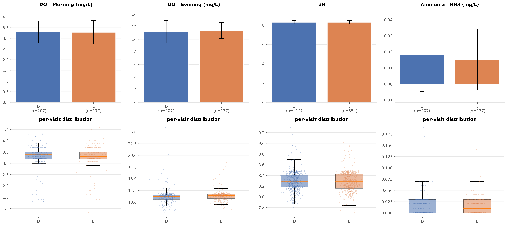
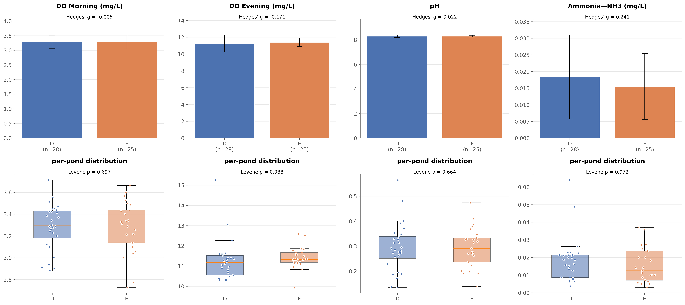
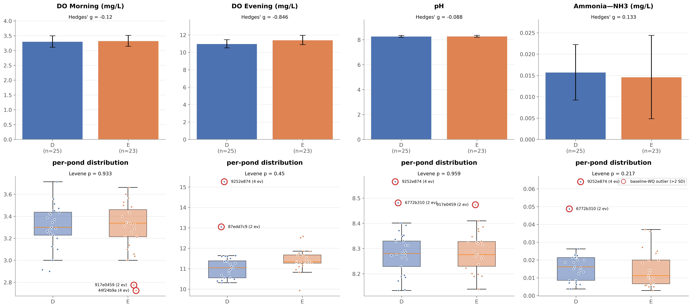
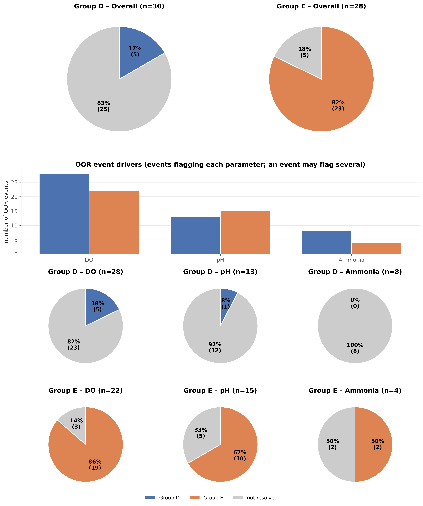
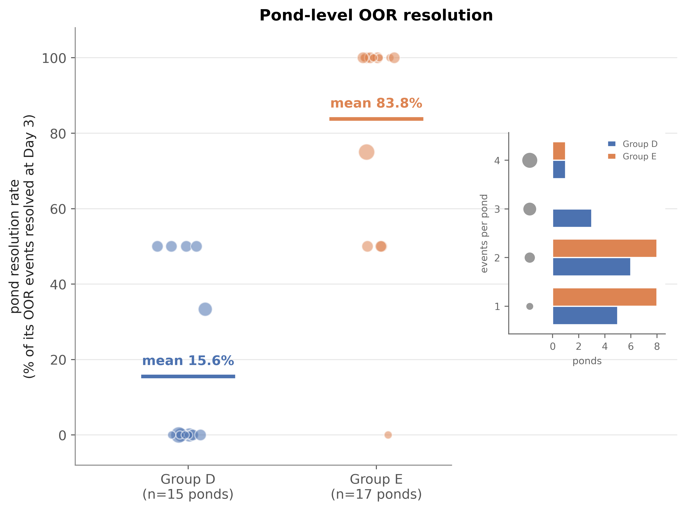
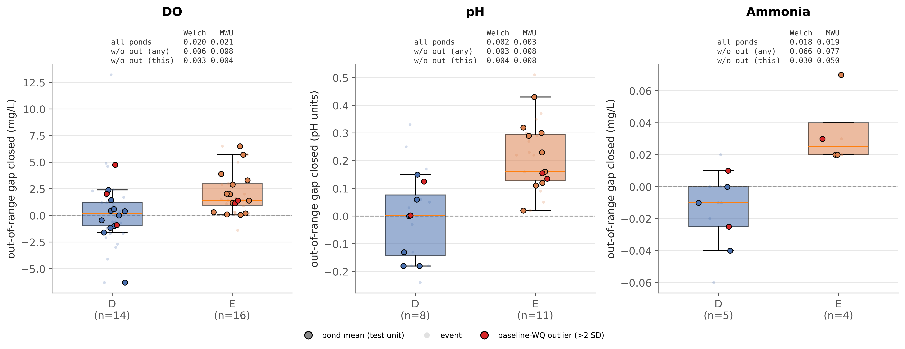
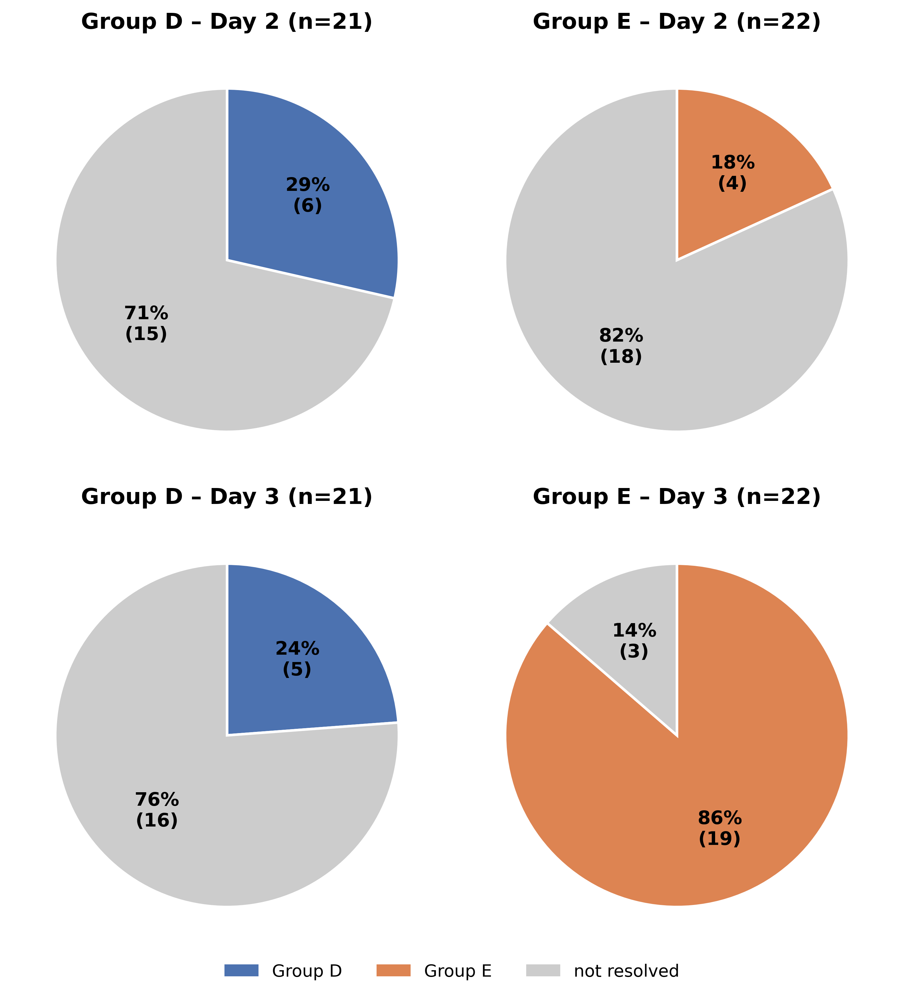

# Analysis Results

Headline numbers are produced by `python main.py`. This file is the
summary, with the key figures embedded inline; see
[`figures.md`](figures.md) for a panel-by-panel walkthrough of every figure and
all methodological details.

> [!NOTE]
> The analysis was run blind: cohorts are labelled Group D and Group E (not
> Control/Treatment) to reduce analyst bias. All tests are run two-sided as
> D vs E. Significance threshold throughout is p < 0.05.

**Contents:** [Highlights](#highlights) · [1. Dataset overview](#1-dataset-overview) · [2. Baseline comparability](#2-are-the-groups-comparable-at-baseline) · [3. Primary outcome](#3-primary-outcome--resolution-at-day-3) · [4. Comparative test](#4-comparative-test--how-much-did-water-quality-improve) · [5. Day 2 vs Day 3](#5-secondary--does-follow-up-timing-matter-day-2-vs-day-3) · [6. Notes on test choices](#6-notes-on-test-choices) · [Glossary](#glossary)

 

## Highlights

> [!IMPORTANT]
> - **The groups are well matched at baseline — same water-quality means and spreads.**
> - **Group E resolves far more OOR events: 82.1% vs 16.7% at Day 3 (Fisher's p = 9.4×10⁻⁷).**
> - **Group E improves more on every parameter (DO, pH, ammonia), and the gap holds after dropping outlier ponds.**
> - **The effect appears only by Day 3: the groups look alike at Day 2 (~20–25% resolution), then E jumps to 82%.**

 

## 1. Dataset overview

| | Group D | Group E | Total |
|---|--:|--:|--:|
| Monitoring visits | 532 | 466 | 998 |
| &nbsp;&nbsp;routine (non-follow-up) | 414 | 354 | 768 |
| &nbsp;&nbsp;follow-up (Day 2 / Day 3) | 118 | 112 | 230 |
| Ponds (baseline) | 28 | 25 | 53 |
| OOR events | 30 | 28 | 58 |
| Ponds with OOR events | 15 | 17 | 32 |

An OOR event is one pond-day on which a water-quality parameter was out of
range; several events can come from the same pond. Routine (non-follow-up) visits
are the baseline-WQ sample. Follow-ups are conditional on an OOR event, so only
routine visits give an unbiased baseline (collapsed to per-pond means in §2):

*Figure 1 — visit-level baseline water quality: one point per routine visit (DO split
by time of day). Top panels show the group mean ± SD; bottom panels show the
box (median, IQR) with every visit as a jittered point. Collapsed to one mean per
pond for the §2 balance tests.*

 

## 2. Are the groups comparable at baseline?

### 2.1 Baseline water quality — mean (SD) per pond

Routine (non-follow-up) visits, averaged to one value per pond. Averaging per pond
ensures ponds visited more often don't count more (i.e., avoids pseudoreplication). 
DO is split by time of day because morning and evening differ systematically.

| Parameter | In-range band | Group D | Group E |
|---|---|--:|--:|
| DO morning (mg/L) | 3–5 | 3.28 (0.21) | 3.28 (0.24) |
| DO evening (mg/L) | 8–12 | 11.26 (1.01) | 11.40 (0.52) |
| pH | 6.5–8.5 | 8.30 (0.10) | 8.29 (0.08) |
| Ammonia, NH₃ (mg/L) | < 0.05 | 0.018 (0.013) | 0.016 (0.010) |

*Figure 2 — per-pond baseline water quality: mean ± SD bars (top) and box + strip
(bottom) for each parameter. Hedges' g and Levene p are given in the panel titles,
and explained below (§2.2).*

### 2.2 Baseline water quality — do the groups have the same spread and average?

| Parameter | Levene p | Hedges' g |
|---|--:|--:|
| DO morning | 0.697 | −0.005 |
| DO evening | 0.088 | −0.171 |
| pH | 0.664 | 0.022 |
| Ammonia | 0.972 | 0.241 |

Both columns use the same per-pond baseline values as §2.1 (one value per pond, 28
D / 25 E), so the comparison is between ponds, not the 768 individual visits.

What the two columns mean: Two groups can match on their average yet differ
in spread, so both are checked (full definitions in the glossary). **Levene's test**
compares spread, and p > 0.05 means no evidence the spreads differ — every p
here clears it (smallest 0.088, DO evening). **Hedges' g** is the gap between the
means in pooled-SD units, an effect size rather than a test (|g| ≈ 0.2 is small)
— the largest here is ammonia at 0.24, the rest near zero. Neither shows a
meaningful difference, so the groups start out comparable and the differences in
§§3–5 aren't a baseline artifact.

### 2.3 Baseline-WQ outlier ponds

Five ponds sit more than 2 SD from their group mean on at least one baseline
parameter, for 9 flags in total; they are used only for sensitivity checks.
Since some ponds are extreme on more than one parameter, each pond's first
appearance in the table is bold-underlined to make the repeat offenders easy
to spot.

| Parameter | Group | Pond | Value | Std. residual |
|---|---|---|--:|--:|
| DO morning | E | **<u>44f24b9a</u>** | 2.73 | −2.53 |
| DO morning | E | **<u>917e0459</u>** | 2.78 | −2.30 |
| DO evening | D | **<u>87edd7c9</u>** | 13.05 | 2.24 |
| DO evening | D | **<u>9252e874</u>** | 15.26 | 5.00 |
| pH | D | **<u>6772b310</u>** | 8.48 | 2.13 |
| pH | D | 9252e874 | 8.57 | 3.09 |
| pH | E | 917e0459 | 8.47 | 2.07 |
| Ammonia | D | 6772b310 | 0.049 | 2.71 |
| Ammonia | D | 9252e874 | 0.064 | 4.07 |

*Figure 3 — the §2.1 per-pond baseline with these 5 outlier ponds excluded from every
statistic and marked as red-ringed points (with their OOR-event count).*

 

## 3. Primary outcome — resolution at Day 3

"Resolved" = the pond was back in range at the Day-3 (primary) follow-up. DO
drives most OOR events, then pH, then ammonia. Note that a single event can flag
several parameters (see the middle "event drivers" bars below).

<table>
<tr>
<td align="center"><b>Left: all OOR events</b></td>
<td align="center"><b>Right: anomalous ponds removed</b></td>
</tr>
<tr>
<td valign="top"></td>
<td valign="top"></td>
</tr>
</table>

*Figure 4 (left, all ponds) and Figure 5 (right, the 5 baseline-WQ outlier ponds removed)
— Day-3 resolution: overall pies per group (top), how many events flagged each
parameter (middle bars), and per-parameter pies (bottom). Group colour = resolved,
grey = not resolved. Figure 5 is the sensitivity check — the picture barely changes.*

### 3.1 Resolution rate

| Resolution rate | Group D | Group E |
|---|--:|--:|
| **All ponds** | | |
| &nbsp;&nbsp;event-level (each event once) | 5 / 30 = 16.7% | 23 / 28 = 82.1% |
| &nbsp;&nbsp;pond-level (mean of per-pond rates) | 15.6% (15 ponds) | 83.8% (17 ponds) |
| **Baseline-WQ outlier ponds removed** | | |
| &nbsp;&nbsp;event-level | 5 / 22 = 22.7% | 19 / 22 = 86.4% |
| &nbsp;&nbsp;pond-level | 19.4% (12 ponds) | 86.7% (15 ponds) |

Event-level counts each event once; pond-level counts each pond once (mean of
per-pond rates), which rules out a few repeat-event ponds driving the gap.
Removing the 5 outlier ponds leaves the gap intact — if anything, it widens
slightly — so the result isn't an artifact of a handful of unusual ponds.

The summary rates hide how the ponds are distributed, so Figure 6 plots each pond
individually, confirming the gap is a broad shift rather than a few high-event
ponds skewing the mean:

*Figure 6 — the pond-level view: one point per pond (area ∝ its OOR-event count); the
bar marks each group's mean per-pond rate. Shows the D-vs-E gap holds when every
pond counts once.*

### 3.2 Fisher's exact test (the formal primary test)

The binary outcome (resolved vs not) by group is a 2×2 table → Fisher's exact.
Left: all ponds. Right: with the 5 baseline-WQ outlier ponds removed (shown as
Figure 5 above). Cells are event counts, so the rates here match the event-level rows
in §3.1 (22.7% / 86.4% on the right), not the pond-level rows.

<table>
<tr><td>

**All ponds**

| | Resolved | Not resolved |
|---|--:|--:|
| Group D | 5 | 25 |
| Group E | 23 | 5 |

</td><td>

**Outlier ponds removed**

| | Resolved | Not resolved |
|---|--:|--:|
| Group D | 5 | 17 |
| Group E | 19 | 3 |

</td></tr>
</table>

| | All ponds | Outlier ponds removed |
|---|--:|--:|
| Odds ratio | 0.043 | 0.046 |
| p-value | **9.4×10⁻⁷** | **4.8×10⁻⁵** |

**Reading the numbers.** Group E's odds of resolving are roughly 23× Group D's
(odds ratio 0.043: D's odds are about 4% of E's). The p-value, 9.4×10⁻⁷ (about 1
in a million), is how often chance alone would produce a gap this large if the groups
were identical — so the difference is real, not noise. Removing the outlier ponds
barely moves either (0.046; 4.8×10⁻⁵).

### 3.3 Resolution by parameter (Day 3)

Events involving each parameter; multi-parameter events count toward each.

| Parameter | D events | D resolved | D % | E events | E resolved | E % |
|---|--:|--:|--:|--:|--:|--:|
| Overall | 30 | 5 | 16.7 | 28 | 23 | 82.1 |
| DO | 28 | 5 | 17.9 | 22 | 19 | 86.4 |
| pH | 13 | 1 | 7.7 | 15 | 10 | 66.7 |
| Ammonia | 8 | 0 | 0.0 | 4 | 2 | 50.0 |

 

## 4. Comparative test — how much did water quality improve?

Section 3 asked whether a pond resolved (yes/no); this section asks how far it
moved. The measure is the out-of-range gap closed: how far the reading sat
outside its in-range band at Day 0, minus how far it sat outside at Day 3, in native
units. A positive value means the pond moved back toward the band; the full Day-0
distance means it reached it.

Each pond contributes one value (its mean across events), so no pond is
double-counted. Every parameter is tested two ways: Welch's t on the means and
Mann-Whitney U on the ranks. Each parameter keeps its own native units; there is
no pooled cross-parameter test — the overall D-vs-E comparison is §3's
resolution rate.

Each test is then re-run with the baseline-WQ outlier ponds removed, under two
rules:
- **any-param** — once a pond is flagged on any parameter, it is dropped from
  *every* test (whole-pond removal).
- **this-param** — a flagged pond is dropped only from the parameter it was extreme
  on, and kept in the others.

Means are all-ponds (descriptive). Each p compares D vs E and is Welch's t; the
rank-based Mann-Whitney test agrees on every call (same significant/not pattern),
so it's omitted from the cells for clarity. **Bold** = p < 0.05.

| Parameter | n (D / E) | Mean D | Mean E | p (all) | p (−out, any) | p (−out, this) |
|---|:--:|--:|--:|--:|--:|--:|
| DO (mg/L) | 14 / 16 | +0.05 | +2.10 | **0.020** | **0.006** | **0.003** |
| pH | 8 / 11 | −0.02 | +0.21 | **0.0017** | **0.003** | **0.004** |
| Ammonia (mg/L) | 5 / 4 | −0.01 | +0.04 | **0.018** | 0.066 | **0.030** |

Positive mean = moved toward range; Group E is higher on every parameter. (A
negative Group-D value means D ponds, on average, drifted further out of range.)
The effect survives outlier removal on all three parameters. (The lone p >
0.05 — ammonia at 0.066 under the blunt any-param rule — is just lost power: that
rule also strips a DO/pH outlier's ammonia events, dropping ammonia to n = 3 vs 3.
Under the targeted this-param rule it's 0.030.)

**Why two tests.**

- **Welch's t** compares the means and allows the two groups to have unequal
  spread.

- **Mann-Whitney U** compares ranks — whether an E pond tends to out-improve a D
  pond — so it's unbothered by skew or a lone extreme pond.

- With small n and the baseline outliers, a mean-based and a rank-based test
  agreeing shows the result isn't riding on one odd pond.

*Figure 7 — the data behind these tests: out-of-range gap closed per pond, one panel
per parameter. The box summarises the pond means (solid dots); faint dots are the
individual events; red dots are the baseline-WQ outlier ponds.*

 

## 5. Secondary — does follow-up timing matter? (Day 2 vs Day 3)

Would we have reached the same conclusion at Day 2? Here each event is compared
against itself at its two follow-ups (`1st FU` vs `2nd FU`), so the tool is
McNemar's test (see glossary), which looks only at the events that changed:
flipped to resolved (Gained) or back out of range (Lost). It needs both
follow-ups recorded, which holds for 57 of 58 events; the missing one is Group
D's, so D's Day-3 rate reads 17.2% (5/29) here rather than §3's 16.7% (5/30).

| Group | n | Day 2 resolved | Day 3 resolved | Gained (No→Yes) | Lost (Yes→No) | McNemar p |
|---|--:|--:|--:|--:|--:|--:|
| **All ponds** | | | | | | |
| &nbsp;&nbsp;D | 29 | 20.7% | 17.2% | 1 | 2 | 1.0 |
| &nbsp;&nbsp;E | 28 | 25.0% | 82.1% | 16 | 0 | **3.05×10⁻⁵** |
| **Outlier ponds removed** | | | | | | |
| &nbsp;&nbsp;D | 21 | 28.6% | 23.8% | 1 | 2 | 1.0 |
| &nbsp;&nbsp;E | 22 | 18.2% | 86.4% | 15 | 0 | **6.1×10⁻⁵** |

<table>
<tr>
<td align="center"><b>Left: all events</b></td>
<td align="center"><b>Right: anomalous ponds removed</b></td>
</tr>
<tr>
<td valign="top"></td>
<td valign="top"></td>
</tr>
</table>

*Figure 8 (left, all ponds) and Figure 9 (right, the 5 baseline-WQ outlier ponds removed)
— the same events scored at Day 2 (top) and Day 3 (bottom). At Day 2 both groups sit
near 20–25% resolved; only by Day 3 does Group E fill in (82%) while Group D stays put.
Figure 9 is the sensitivity check — dropping the outlier ponds leaves the timing story
intact (at Day 2 the groups are still level, E even slightly behind D).*

Group D's 1-gained-2-lost is exactly what chance produces (p = 1.0). Group E's
16-to-0 would essentially never happen by chance (p = 3.05×10⁻⁵, about 3 in
100,000). And the groups were indistinguishable at Day 2 itself (20.7% vs 25.0%,
Fisher's p = 0.76), so the entire Group-E effect appears in the one extra day
between Day 2 and Day 3 — had the study stopped at Day 2 it would have found
nothing, which is why Day 3 is the protocol's primary measure. Dropping the
outlier ponds changes none of this (bottom half of the table; Figure 9).

 

## 6. Notes on test choices

<b>Expand methodology notes</b>

 

- **Two-sided tests.** The analysis was run blind (D vs E), so we couldn't
  assume in advance which group should do better. Every test is therefore two-sided, which
  is the more conservative choice: it splits the 0.05 significance budget across
  both tails rather than spending it all on one expected direction.
- **Pond-level vs event-level.** The continuous tests (§4) use one value
  per pond, because repeated events from the same pond are not independent and
  counting each separately would overstate the sample size (pseudoreplication).
  The binary resolution tests (Fisher, §3) and the Day-2/3 test (§5) are
  event-level, since a resolved/not-resolved event is the unit the protocol
  defines for the primary outcome.
- **No within-cohort before/after test.** Day-0 readings are picked precisely
  because they are out of range, so on re-measurement they tend to drift back
  toward normal on their own — regression to the mean. A before/after test within
  one group would credit that drift to the intervention. The between-cohort
  comparison sidesteps it: regression to the mean acts on both groups, so it
  cancels, and any remaining gap is attributable to the treatment.

 

## Glossary

<b>Expand definitions</b>

 

- **OOR event / resolution** — an out-of-range pond-day (a parameter outside its
  band on a given day); "resolved" = back inside the band at the Day-3 follow-up.
- **In-range band** — the acceptable range per parameter (protocol Table 1): DO
  3–5 mg/L morning, 8–12 evening; pH 6.5–8.5; ammonia < 0.05 mg/L.
- **Out-of-range gap closed** — the distance a reading sat outside its band at Day
  0 minus the distance at Day 3 (native units). Positive means it moved toward
  range. It clamps at the band edge, so a reading that overshoots into the range
  earns no extra credit.
- **Hedges' g** — the difference between the two group means, rescaled into
  pooled-standard-deviation units, with a correction for small samples. It is an
  effect size rather than a test: it reports how far apart the averages are and
  carries no p-value. Rough scale: |g| < 0.1 negligible, 0.2 small, 0.5 medium,
  0.8 large. It is the mean-gap companion to Levene, which instead compares spread.
- **Levene's test** — tests whether two groups have equal variance (spread),
  reported as a p-value (p > 0.05 = no evidence the spreads differ). We use the
  median-centred Brown–Forsythe variant (robust to non-normal data) on the
  per-pond baseline values.
- **Studentized residual** — how many standard deviations a pond's value sits from
  its group mean; an absolute value above 2 flags it as an outlier.
- **Fisher's exact test** — computes the exact probability of a 2×2 count table
  (here resolved/not by group) instead of relying on a large-sample approximation,
  so it stays valid when the cell counts are small.
- **Odds ratio** — for a 2×2 table, the ratio of one group's odds of resolving to
  the other's (odds = resolved ÷ not-resolved). 1.0 = no difference; the further
  from 1, the larger the gap. It is the effect-size companion to Fisher's p: the p
  says whether the gap is real, the odds ratio says how big.
- **Welch's t-test** — compares two group means without assuming the groups have
  equal variance or equal sample size.
- **Mann-Whitney U** — ranks all the values from both groups together and tests
  whether one group's values tend to rank higher. It uses only order, not the raw
  values, so it assumes no particular distribution and resists skew and outliers.
- **McNemar's test** — the paired counterpart for binary data. It tests whether a
  before/after proportion (Day 2 → Day 3) changed, using only the discordant pairs
  (events that flipped one way or the other) and ignoring those that stayed put.
- **Pseudoreplication** — treating non-independent measurements (e.g. several
  events from the same pond) as if they were independent, which inflates the
  apparent sample size and overstates significance. Avoided by analysing one value
  per pond.
- **p-value** — the probability of seeing a difference at least as large as the
  one observed if the groups were truly the same. It is computed assuming no real
  difference, so it is not the probability that there is no effect. Smaller =
  stronger evidence; we use p < 0.05.

