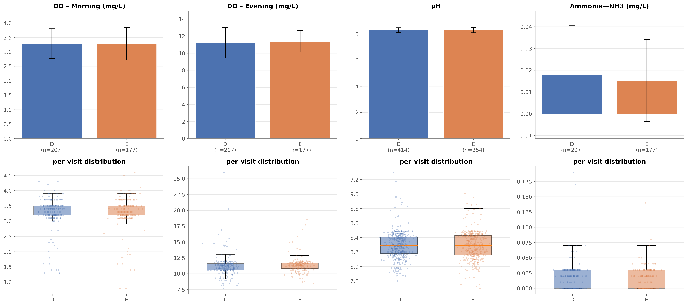
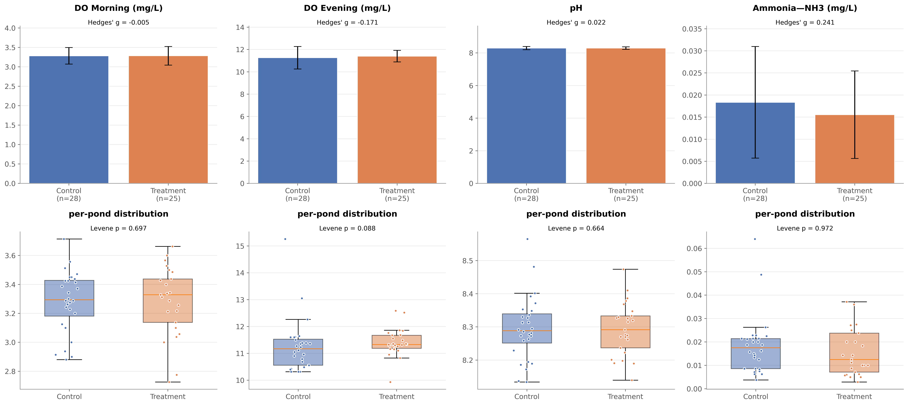
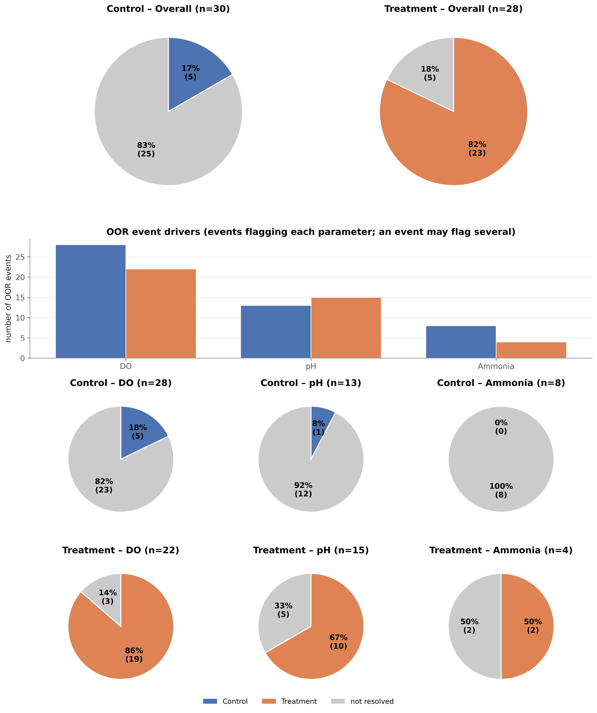
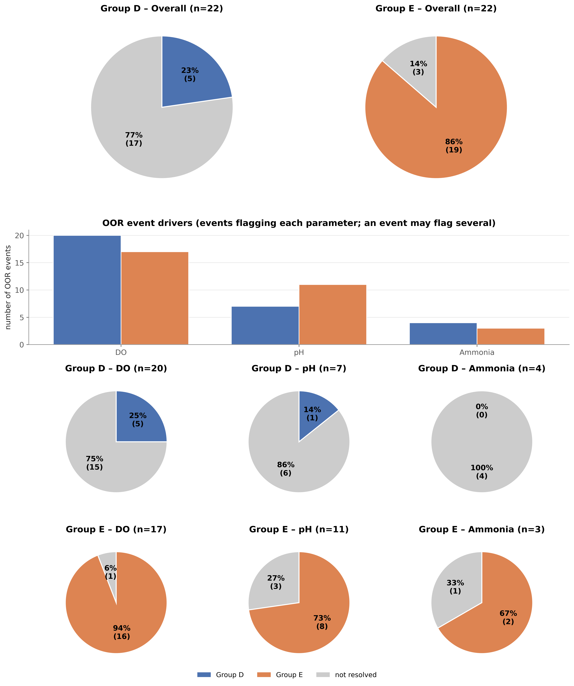
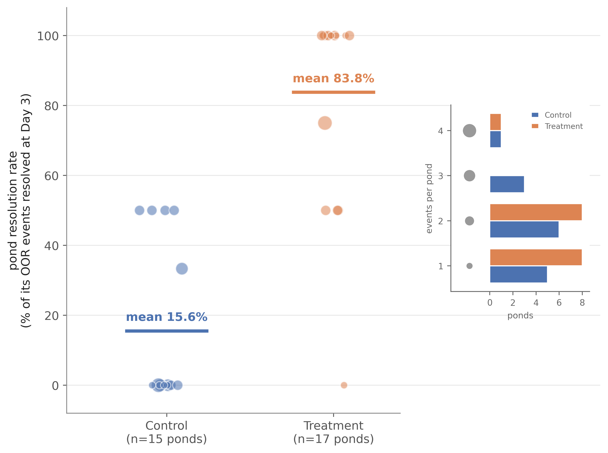
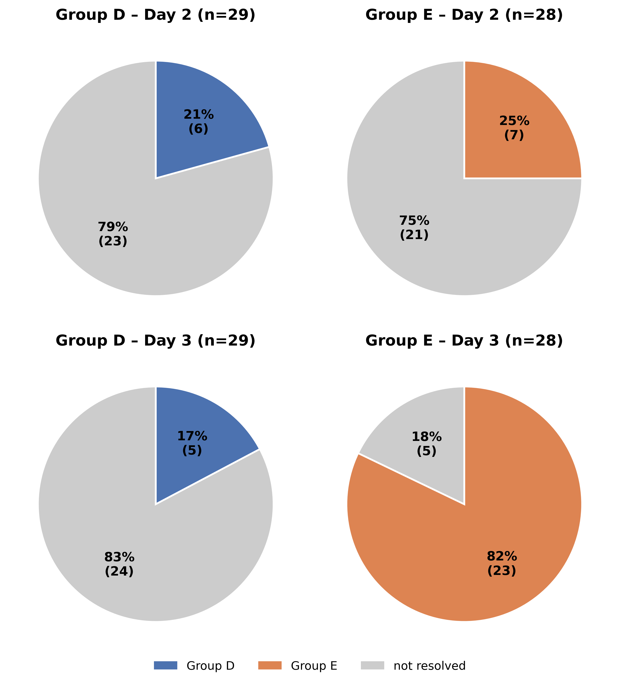
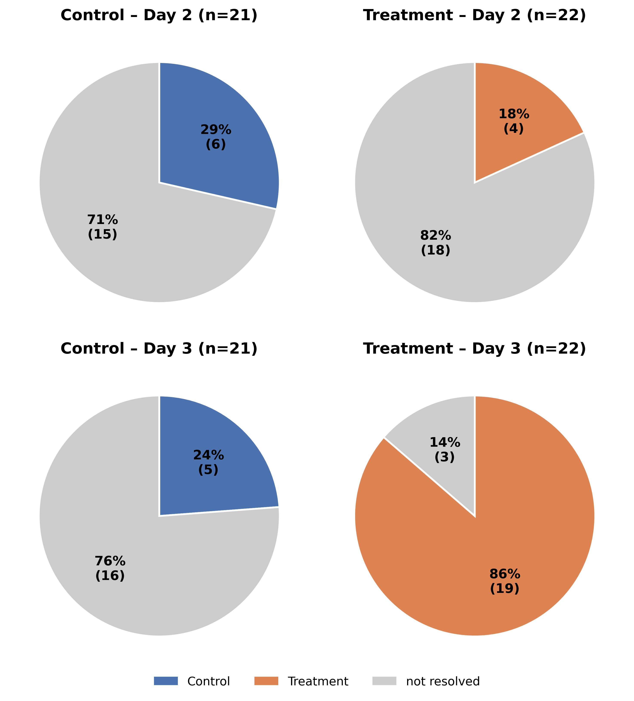

# Analysis Results

This document summarises the primary results, which test the following hypothesis:

> **Giving farmers water quality readings plus recommended corrective actions improves pond water quality.**

The outcome is measured as the share of out-of-range (OOR) water quality events resolved 
at follow-up, compared between a treatment cohort and a control cohort that received
no corrective-action recommendations. The numbers and figures in this summary are
produced by `python main.py`; see [`figures.md`](figures.md) for a panel-by-panel
walkthrough of every figure and all methodological details.

The analysis was run blind to reduce analyst bias: cohorts are labelled Group D
and Group E (i.e., not Control/Treatment), and all tests are run two-sided as D vs E
with a significance threshold throughout of p < 0.05. The study has since been
unblinded; [§6](#6-post-hoc--do-farmers-own-actions-explain-the-gap) adds a post-hoc analysis on the unblinded data, but [§1](#1-dataset-overview)–[5](#5-secondary--does-follow-up-timing-matter-day-2-vs-day-3) keep the
blind labels as run.

**Contents:** [Highlights](#highlights) · [1. Dataset overview](#1-dataset-overview) · [2. Baseline comparability](#2-are-the-groups-comparable-at-baseline) · [3. Primary outcome](#3-primary-outcome--resolution-at-day-3) · [4. Comparative test](#4-comparative-test--how-much-did-water-quality-improve) · [5. Day 2 vs Day 3](#5-secondary--does-follow-up-timing-matter-day-2-vs-day-3) · [6. Self-initiated actions](#6-post-hoc--do-farmers-own-actions-explain-the-gap) · [7. Notes on test choices](#7-notes-on-test-choices) · [Glossary](#glossary)

 

## Highlights

- Two cohorts: treatment (E) got water quality readings plus corrective-action advice; control (D) got neither.
- The groups are well matched at baseline: same water quality means and spreads.
- Group E resolves far more OOR events: 82.1% vs 16.7% at Day 3 (Fisher's p = 9.4×10⁻⁷).
- Group E improves more on every parameter (DO, pH, ammonia), and this holds after dropping outlier ponds.
- The effect appears only by Day 3: the groups look alike at Day 2 (~20–25% resolution), then E jumps to 82%.
- Farmers' own actions are unable to explain the difference between groups (D vs. E) or days (Day 2 vs. 3).
- **The evidence strongly supports that the interventions (water quality readings plus recommended actions) improve pond water quality.**

 

## 1. Dataset overview

The study followed 53 ponds over 998 monitoring visits between February and May
2026, split between the two cohorts:

| | Group D | Group E | Total |
|---|--:|--:|--:|
| Monitoring visits | 532 | 466 | 998 |
| &nbsp;&nbsp;routine (non-follow-up) | 414 | 354 | 768 |
| &nbsp;&nbsp;follow-up (Day 2 / Day 3) | 118 | 112 | 230 |
| Ponds (baseline) | 28 | 25 | 53 |
| OOR events | 30 | 28 | 58 |
| Ponds with OOR events | 15 | 17 | 32 |

An out-of-range (OOR) event is one pond-day on which a water quality parameter (dissolved oxygen [DO], pH, or ammonia) was out of range; several events can come from the same pond. Follow-up visits are
conditional on an OOR event, so only routine visits, as shown in Figure 1, give an 
unbiased baseline for the water quality parameters:

*Figure 1 — Baseline water quality: one point per routine visit (DO split
by time of day). Top panels show the group mean ± SD. Bottom panels show the
box (median, IQR).*

 

## 2. Are the groups comparable at baseline?

### 2.1 Baseline water quality — mean (SD) per pond

The first question is whether the two groups started level; if not, any gap in
outcomes could reflect pre-existing differences rather than anything that happened 
during the study. Baseline water quality uses routine (non-follow-up) visits, averaged
to one value per pond so that ponds visited more often do not count more; DO is split 
by time of day because morning and evening differ systematically.

| Parameter | In-range band | Group D (n = 28) | Group E (n = 25) |
|---|---|--:|--:|
| DO morning (mg/L) | 3–5 | 3.28 (0.21) | 3.28 (0.24) |
| DO evening (mg/L) | 8–12 | 11.26 (1.01) | 11.40 (0.52) |
| pH | 6.5–8.5 | 8.30 (0.10) | 8.29 (0.08) |
| Ammonia, NH₃ (mg/L) | < 0.05[^amm] | 0.018 (0.013) | 0.016 (0.010) |

*Figure 2 — per-pond baseline water quality: one point per pond. As in Figure 1, mean ± SD bars (top) and box + strip
(bottom) for each parameter. Hedges' g and Levene p are also given, and explained below ([§2.2](#22-baseline-water-quality--do-the-groups-have-the-same-spread-and-average)).*

### 2.2 Baseline water quality — do the groups have the same spread and average?

We now use two complementary checks — one for differences in spread, one for gap between means — to
see whether the groups differ on either: see the below table. Both columns use the same per-pond, 
mean-averaged baseline values as [§2.1](#21-baseline-water-quality--mean-sd-per-pond) (one value per pond), so the comparison is 
between ponds, not the individual visits.

| Parameter | Levene p | Hedges' g |
|---|--:|--:|
| DO morning | 0.697 | −0.005 |
| DO evening | 0.088 | −0.171 |
| pH | 0.664 | 0.022 |
| Ammonia | 0.972 | 0.241 |

Two groups can match on their average yet differ in spread, so both are checked 
(full definitions in the glossary). **Levene's test** compares spread, and p > 0.05 
means no evidence the spreads differ. It asks: if the two groups truly had equal 
spread, how often would a spread difference this big appear just by chance? 
p clears this threshold for every water quality parameter (smallest 0.088, DO evening). 
**Hedges' g** measures how far apart the two group averages sit, in units of the 
pond-to-pond spread: the largest value here, ammonia's 0.24, means those group means
differ by about a quarter of a standard deviation; the other parameters are near zero. 
It is an effect size, not a test — no p-value, just a rough scale on which 0.2 is
generally considered small. 

So neither column shows a meaningful difference: the groups start
out comparable, and the differences in later sections are not a baseline
artifact.

### 2.3 Baseline-WQ outlier ponds

Before moving on to the main analysis, we check for any ponds that are 
outliers with respect to their baseline water quality parameters. Five 
ponds sit more than 2 SD from their group mean on at least one baseline
parameter, for 9 flags in total. Since some ponds are extreme on more than 
one parameter, each pond's first appearance in the table is bolded to clearly
identify these potentially anomalous ponds. 

| Parameter | Group | Pond | Value | Std. residual |
|---|---|---|--:|--:|
| DO morning | E | **44f24b9a** | 2.73 | −2.53 |
| DO morning | E | **917e0459** | 2.78 | −2.30 |
| DO evening | D | **87edd7c9** | 13.05 | 2.24 |
| DO evening | D | **9252e874** | 15.26 | 5.00 |
| pH | D | **6772b310** | 8.48 | 2.13 |
| pH | D | 9252e874 | 8.57 | 3.09 |
| pH | E | 917e0459 | 8.47 | 2.07 |
| Ammonia | D | 6772b310 | 0.049 | 2.71 |
| Ammonia | D | 9252e874 | 0.064 | 4.07 |

*Figure 3 — the [§2.1](#21-baseline-water-quality--mean-sd-per-pond) per-pond baseline with these 5 outlier ponds excluded from every
statistic and marked as red-ringed points (with their OOR-event count).*

 

## 3. Primary outcome — resolution at Day 3

With the groups comparable at baseline, we now turn to the primary outcome: how
many OOR events were resolved within each group at the Day-3 (primary) follow-up. 
An event is recorded whenever any one of the water quality parameters goes out of range;
it counts as "resolved" only if the pond is back in range on every WQ parameter (DO, pH, and
ammonia), not just the one that triggered it.[^trigger-def] Most events are driven by DO, 
followed by pH and then ammonia, and a single event can flag several parameters at once 
(the middle "event drivers" bars below). We conduct this analysis both for all OOR events 
(below, left) and with the outlier ponds completely removed from the dataset (below, right).

<table>
<tr>
<td align="center"><b>Left: all OOR events</b></td>
<td align="center"><b>Right: outlier ponds removed</b></td>
</tr>
<tr>
<td valign="top"></td>
<td valign="top"></td>
</tr>
</table>

*Figure 4 (left, all ponds) and Figure 5 (right, with the 5 outlier ponds removed)
— Day-3 resolution: overall pies per group (top), how many events flagged each
parameter (middle bars), and per-parameter pies (bottom). Group colour = resolved,
grey = not resolved. Note the picture is consistent with vs. without the outlier ponds.*

### 3.1 Resolution rate

The pie charts above counted every OOR event once; here we also add a pond-level view that
averages each pond's own resolution rate, so that ponds with more events do not
contribute more. The table reports both, with and without the outlier ponds.

| Resolution rate | Group D | Group E |
|---|--:|--:|
| **All ponds** | | |
| &nbsp;&nbsp;event-level (each event once) | 5 / 30 = 16.7% | 23 / 28 = 82.1% |
| &nbsp;&nbsp;pond-level (mean of per-pond rates) | 15.6% (15 ponds) | 83.8% (17 ponds) |
| **With outlier ponds removed** | | |
| &nbsp;&nbsp;event-level | 5 / 22 = 22.7% | 19 / 22 = 86.4% |
| &nbsp;&nbsp;pond-level | 19.4% (12 ponds) | 86.7% (15 ponds) |

The pond-level analysis is consistent with that at the event-level, which rules out a
few repeat-event ponds driving the gap. Removing the 5 outlier ponds leaves the gap
intact (it actually widens slightly). Figure 6 makes the same point pond by pond, but shows 
the distribution itself: one point per pond at its own resolution rate (average over its 
events) and sized by event count. Most Group D ponds resolved nothing, most Group E ponds resolved 
everything, and resolution rate shows no correlation with event count.

*Figure 6 — the pond-level view: one point per pond (point size scaled by pond's OOR-event count); 
the horizontal line marks each group's mean. Inset: how many ponds had each event count (and point-size key).*

### 3.2 Fisher's exact test (the formal test)

The formal test returns to the event level. Resolved vs not, by group, forms a 2×2 count
table, which is the input for Fisher's exact test. Left: all ponds (as shown in Figure 4 above). 
Right: with the 5 outlier ponds removed (as shown in Figure 5). The cells are raw counts, so the
rates match [§3.1](#31-resolution-rate)'s event-level rows, not the pond-level ones.

<table>
<tr><td>

**All ponds**

| | Resolved | Not resolved |
|---|--:|--:|
| Group D | 5 | 25 |
| Group E | 23 | 5 |

</td><td>

**Outlier ponds removed**

| | Resolved | Not resolved |
|---|--:|--:|
| Group D | 5 | 17 |
| Group E | 19 | 3 |

</td></tr>
</table>

| | All ponds | Outlier ponds removed |
|---|--:|--:|
| Odds ratio | 0.043 | 0.046 |
| p-value | **9.4×10⁻⁷** | **4.8×10⁻⁵** |

Group E's odds of resolving are roughly 23× Group D's (odds ratio 0.043: 
D's odds are about 4% of E's). The p-value, 9.4×10⁻⁷ (approx. 1 in a million), 
is how often chance alone would produce a gap this large if the groups
were identical. So the difference is real, not noise. Removing the outlier ponds
keeps both metrics very small (0.046; 4.8×10⁻⁵).

### 3.3 Resolution by parameter (Day 3)
We now check whether the overall gap rides on a single parameter — say, Group E only does
better at fixing DO — by splitting the Day-3 outcome by which parameter was out
of range. Rows count the events involving each parameter, so an event flagging two (e.g.
DO and pH) appears in both rows.
  
| Parameter | D events | D resolved | D % | E events | E resolved | E % |
|---|--:|--:|--:|--:|--:|--:|
| DO | 28 | 5 | 17.9 | 22 | 19 | 86.4 |
| pH | 13 | 1 | 7.7 | 15 | 10 | 66.7 |
| Ammonia | 8 | 0 | 0.0 | 4 | 2 | 50.0 |

Group E leads on every parameter, so the overall gap is not a function of any single WQ parameter 
(DO simply dominates the event counts in both groups).

 

## 4. Comparative test — how much did water quality improve?

Section 3 asked whether a pond resolved after an OOR event (i.e., a binary outcome); this section asks how far it moved (a continuous outcome). The continuous measure is the out-of-range gap closed: this is distance outside the in-range water quality region (the "band", bound by a minimum and/or maximum) at the event triggering on Day 0 minus the distance at Day 3 (positive = moved back toward the band). Each pond contributes one value (its mean across events), and each WQ parameter keeps its own units. Since mg/L and pH points cannot be pooled into one score without an arbitrary conversion, parameters are tested separately.
  
We compare D vs E with two tests (means in the table are group averages of the per-pond values).
**Welch's t** works on the difference between the means: as throughout, its p is the chance of 
a mean gap at least this large if the groups had really improved equally, so a small p is evidence 
*against* their being alike (see glossary for more detail). The rank-based **Mann-Whitney** U is the 
second check, and it is based on the ranks of the values rather than their magnitudes — it tests
whether one group's values tend to rank higher, ignoring how large the gaps are. It provides reassurance
at these small n, since ranks cannot be dragged by extreme ponds the way a mean can. The −out columns
re-run each test with the 5 outlier ponds completely dropped from every parameter. **Bold** = p < 0.05.

| Parameter | n (D / E) | Mean D | Mean E | Welch p (all) | Welch p (−out) | MWU p (all) | MWU p (−out) |
|---|:--:|--:|--:|--:|--:|--:|--:|
| DO (mg/L) | 14 / 16 | +0.05 | +2.10 | **0.020** | **0.006** | **0.021** | **0.008** |
| pH | 8 / 11 | −0.02 | +0.21 | **0.0017** | **0.003** | **0.0034** | **0.008** |
| Ammonia (mg/L) | 5 / 4 | −0.01 | +0.04 | **0.018** | 0.066 | **0.019** | 0.077 |

The two tests agree for every WQ parameter. Group E improves more on every parameter, 
while Group D's mean pH and ammonia drift slightly further out of range. DO and pH stay
significant after outlier removal; only ammonia slips above 0.05 (Welch 0.066, MWU
0.077), because dropping outlier ponds cuts it to n = 3 vs 3 (from 5 vs 4).

*Figure 7 — the data behind these tests: out-of-range gap closed per pond, one panel
per parameter. The box summarises the pond means (solid dots); faint dots are the
individual events; red dots are the baseline-WQ outlier ponds.*

 

## 5. Secondary — does follow-up timing matter? (Day 2 vs Day 3)

This secondary analysis asks whether we would have reached the same conclusion at
Day 2 (the first follow-up) relative to the primary measure on Day 3 (the second
follow-up). Each event is now compared against itself at its two follow-ups (`1st FU` vs
`2nd FU`) rather than across groups. The relevant tool is then McNemar's test, which is
the paired counterpart to [§3](#3-primary-outcome--resolution-at-day-3)'s Fisher's exact test (both read a 2×2 count table; McNemar's just
uses the same events measured twice in place of two independent groups, see glossary).
It looks only at the events that changed: flipped to resolved (Gained) or back out of
range (Lost). It needs both follow-ups recorded, which holds for 57 of 58 events; the
missing one is Group D's, so D's Day-3 rate reads 17.2% (5/29) here rather than [§3](#3-primary-outcome--resolution-at-day-3)'s
16.7% (5/30).

| Group | n | Day 2 resolved | Day 3 resolved | Gained (No→Yes) | Lost (Yes→No) | McNemar p |
|---|--:|--:|--:|--:|--:|--:|
| **All ponds** | | | | | | |
| &nbsp;&nbsp;D | 29 | 20.7% | 17.2% | 1 | 2 | 1.0 |
| &nbsp;&nbsp;E | 28 | 25.0% | 82.1% | 16 | 0 | **3.05×10⁻⁵** |
| **Outlier ponds removed** | | | | | | |
| &nbsp;&nbsp;D | 21 | 28.6% | 23.8% | 1 | 2 | 1.0 |
| &nbsp;&nbsp;E | 22 | 18.2% | 86.4% | 15 | 0 | **6.1×10⁻⁵** |

<table>
<tr>
<td align="center"><b>Left: all events</b></td>
<td align="center"><b>Right: outlier ponds removed</b></td>
</tr>
<tr>
<td valign="top"></td>
<td valign="top"></td>
</tr>
</table>

*Figure 8 (left, all ponds) and Figure 9 (right, the 5 baseline-WQ outlier ponds removed)
— the same events scored at Day 2 (top) and Day 3 (bottom). At Day 2 both groups sit
near 20–25% resolved; only by Day 3 does Group E fill in (82%) while Group D stays constant.
Figure 9 shows that this story is consistent even after dropping the outlier ponds.*

Group D's 1-gained-2-lost is exactly what chance produces (p = 1.0). Group E's
16-to-0 would essentially never happen by chance (p = 3.05×10⁻⁵, about 3 in
100,000). And the groups were indistinguishable at Day 2 itself (20.7% vs 25.0%,
Fisher's p = 0.76), so the entire Group-E effect appears in the one extra day
between Day 2 and Day 3. Hence had the study stopped at Day 2 it would have found
nothing, and dropping the outlier ponds does not change this.

 

## 6. Post-hoc — do farmers' own actions explain the gap?

> [!NOTE]
> This is the only part of the analysis added after unblinding — i.e., after the
> reveal that **Group D = Control** and **Group E = Treatment**. Numbers are
> produced by `python main_sia.py`.

Here we ask whether the resolution gap between Control and Treatment could be an artifact
of farmers taking their own, self-initiated actions (SIA). In other words, one group's
farmers might simply have taken more corrective steps on their own, so what looks like an
effect of the intervention could really be the effect of those SIAs.

SIA are corrective steps farmers took on their own initiative, separate from the study's
recommendations and recorded only in the unblinded workbook. There are 167 such records,
each dated by when the action was taken, though with varying precision in the recording: 93 carry an exact
day, while the other 74 are dated only relative to the visit (almost all "0–7 days ago"),
placing the action in a window up to a week wide rather than on a single day. Where a record
gives both an exact date and a range, we use the exact date. We call an
OOR event *exposed* if an SIA's window overlaps its Day-0-to-Day-3 span (Day 0 = OOR
detected, Day 3 = primary outcome) — i.e. a farmer acted while the event was still open, so
the action could plausibly have influenced the result. Exposure was common in both cohorts
(Control 13/30 events, Treatment 16/28), making it worth checking.

**Does SIA explain the difference between Control's and Treatment's Day-3 resolution rates?**
If it did, two patterns should show up in the data, but we find neither. First, the difference should shrink once we compare like with like: i.e. only events where *nobody* acted (no SIAs). Instead it stays just as wide (unexposed: Control 23.5% vs Treatment 75.0%, p = 0.0095), and it remains wide when considering only exposed events (i.e., with overlapping SIAs). Second, the SIAs should help: that is, within a cohort, exposed events should resolve more often than unexposed ones. Neither cohort shows that — the exposed-vs-unexposed gap is no bigger than chance would give, which is what these large p-values mean (Control p = 0.355, Treatment p = 0.624). The table below gives both readings:
across each row is D vs E; down each column is exposed vs unexposed (each cell reads
"resolved / total events = percent resolved", e.g. "1 / 13 = 7.7%"; p is Fisher's exact): 

| | Group D (Control) | Group E (Treatment) | p (D vs E) |
|---|--:|--:|--:|
| Exposed | 1 / 13 = 7.7% | 14 / 16 = 87.5% | **2.2×10⁻⁵** |
| Unexposed | 4 / 17 = 23.5% | 9 / 12 = 75.0% | **0.0095** |
| p (exposed vs unexposed) | 0.355 | 0.624 | |

**Did the SIAs cause the Day-2 to Day-3 gains?** [§5](#5-secondary--does-follow-up-timing-matter-day-2-vs-day-3) showed that Treatment's effect resides
mainly in the one day between the two follow-ups: of the 23 events that resolved by Day 3,
16 were "gained" from Day 2 (i.e., still out of range at Day 2, but back in range by Day 3; [§5](#5-secondary--does-follow-up-timing-matter-day-2-vs-day-3)'s "Gained" column).
If an SIA caused one of those gains, it had to fall in that Day-2-to-Day-3 window — i.e. be a
"late" SIA, judged (as before) by its exact date or dated range overlapping that span. Almost
none did: only 2 of the 16 gains had one. And a late SIA gave no advantage: among
the events that could still gain (those out of range at Day 2), the ones with a late action
resolved no more often than the ones without (p = 1.0 in both cohorts). Each cell below reads
"gained / still out of range at Day 2 (percent)", e.g. "2 / 3 (67%)":

| Group | Late action (after Day 2) | No late action | p |
|---|--:|--:|--:|
| Group D (Control) | 0 / 3 (0%) | 1 / 20 (5%) | 1.0 |
| Group E (Treatment) | 2 / 3 (67%) | 14 / 18 (78%) | 1.0 |

**Caveats.** These exposure comparisons are descriptive, not causal: farmers act when a pond
already looks bad, so a cohort's exposed events are likely its most troubled ones. 
That is why Control's exposed events resolve *worse* than its unexposed (7.7% vs 23.5%),
not because acting hurts. So the claim is not that SIA has no effect; it is just that the
Control-vs-Treatment gap, and its Day-3 timing, are not artifacts of farmers' own actions.

 

## 7. Notes on test choices

<b>Expand methodology notes</b>

 

- **Two-sided tests.** The analysis was run blind (D vs E), so we couldn't
  assume in advance which group should do better. Every test is therefore two-sided, which
  is the more conservative choice: it splits the 0.05 significance budget across
  both tails rather than spending it all on one expected direction.
- **Pond-level vs event-level.** The continuous tests ([§4](#4-comparative-test--how-much-did-water-quality-improve)) use one value
  per pond, because repeated events from the same pond are not independent and
  counting each separately would overstate the sample size (pseudoreplication).
  The binary resolution tests (Fisher, [§3](#3-primary-outcome--resolution-at-day-3)) and the Day-2/3 test ([§5](#5-secondary--does-follow-up-timing-matter-day-2-vs-day-3)) are
  event-level, since a resolved/not-resolved event is the unit the protocol
  defines for the primary outcome.
- **No within-cohort baseline-vs-follow-up test.** Day-0 readings are picked for
  being out of range, so they tend to drift back toward normal on their own; this
  regression to the mean would make a within-group before/after test credit the
  drift to the intervention. The between-cohort comparison cancels it, since
  regression acts on both groups equally, leaving any gap attributable to the
  treatment. (The Day-2-vs-Day-3 test in
  [§5](#5-secondary--does-follow-up-timing-matter-day-2-vs-day-3) is unaffected: both
  follow-ups are already past the extreme Day-0 reading.)

 

## Glossary

<b>Expand definitions</b>

 

- **OOR event / resolution** — an out-of-range pond-day (a parameter outside its
  band on a given day); "resolved" = back inside the band on every parameter at the
  Day-3 follow-up, not only the one that triggered the event.
- **In-range band** — the acceptable range per parameter (protocol Table 1): DO
  3–5 mg/L morning, 8–12 evening; pH 6.5–8.5; ammonia < 0.05 mg/L.
- **Out-of-range gap closed** — the distance a reading sat outside its band at Day
  0 minus the distance at Day 3 (native units). Positive means it moved toward
  range. It is cut off at the band edge, so a reading that overshoots into the range
  earns no extra credit.
- **p-value** — the probability of seeing a difference at least as large as the
  one observed if the groups were truly the same. It is computed assuming no real
  difference, so it is not the probability that there is no effect. Smaller =
  stronger evidence; we use p < 0.05 (a 5% chance).
- **Hedges' g** — the difference between the two group means, rescaled into
  pooled-standard-deviation units, with a correction for small samples. It is an
  effect size rather than a test: it reports how far apart the means are and
  carries no p-value. Rough scale: |g| < 0.1 negligible, 0.2 small, 0.5 medium,
  0.8 large. It is the mean-gap companion to Levene, which instead compares spread.
- **Levene's test** — tests whether two groups have equal variance (spread),
  reported as a p-value (p > 0.05 = no evidence the spreads differ). We use the
  median-centred Brown–Forsythe variant (robust to non-normal data) on the
  per-pond baseline values.
- **Studentized residual** — how many standard deviations a pond's value sits from
  its group mean; we flag a pond as an outlier when its absolute value exceeds 2.
- **Fisher's exact test** — computes the exact probability of a 2×2 count table
  (here resolved/not by group). It works the probability out directly rather than
  estimating it, so it stays valid even with the small, single-digit counts here.
- **Odds ratio** — for a 2×2 table, the ratio of one group's odds of resolving to
  the other's (odds = resolved ÷ not-resolved). 1.0 = no difference; the further
  from 1, the larger the gap. It is the effect-size companion to Fisher's p: the p
  says whether the gap is real, the odds ratio says how big.
- **Welch's t-test** — compares two group means and returns a p-value for whether
  they differ, without assuming the groups have equal variance or equal sample size
  (the safer default over the classic Student's t-test). It works on the means
  themselves, so it is the magnitude-based companion to the rank-based Mann-Whitney
  U; [§4](#4-comparative-test--how-much-did-water-quality-improve) runs both so the
  result does not hinge on one set of assumptions.
- **Mann-Whitney U** — ranks all the values from both groups together and tests
  whether one group's values tend to rank higher. It uses only order, not the raw
  values, so it assumes no particular distribution and resists skew and outliers.
  U is the test statistic (as t is for the t-test): across every pairing of a D
  value with an E value, it counts how often one outranks the other (ties count
  ½), so a U far from its midpoint means one group sits consistently higher. Also
  known as the Wilcoxon rank-sum test.
- **McNemar's test** — the paired counterpart to Fisher's exact test for binary
  data: both read a 2×2 table, but McNemar uses the same events measured twice
  (Day 2 → Day 3) in place of two independent groups. It tests whether that
  before/after proportion changed, using only the discordant pairs (events that
  flipped one way or the other) and ignoring those that stayed put.
- **Pseudoreplication** — treating non-independent measurements (e.g. several
  events from the same pond) as if they were independent, which inflates the
  apparent sample size and overstates significance. Avoided by analysing one value
  per pond.
- **Regression to the mean** — the tendency of an extreme measurement to be
  followed by one closer to average on re-measurement, even with no intervention.
  Because OOR events are selected for being out of range at Day 0, their later
  readings tend to drift back toward range on their own; the between-cohort
  comparison controls for this, since it acts on both groups equally.

[^trigger-def]: Scoring resolution on only the triggering parameter(s), rather
    than requiring all of DO, pH, and ammonia back in range, leaves every count
    unchanged: all 58 events keep their Day-3 status, as do the
    [§5](#5-secondary--does-follow-up-timing-matter-day-2-vs-day-3) timing results. The
    two rules can only differ when a trigger returns to range while another parameter
    that was in range at Day 0 has since gone out, which never happens here.

[^amm]: The workbook's `Is WQ in range?` flag treats a reading of exactly 0.05 as
    in-range, and this analysis follows that flag. Only 3 routine readings sit at
    exactly 0.05; none are OOR events, so no statistic is affected.
